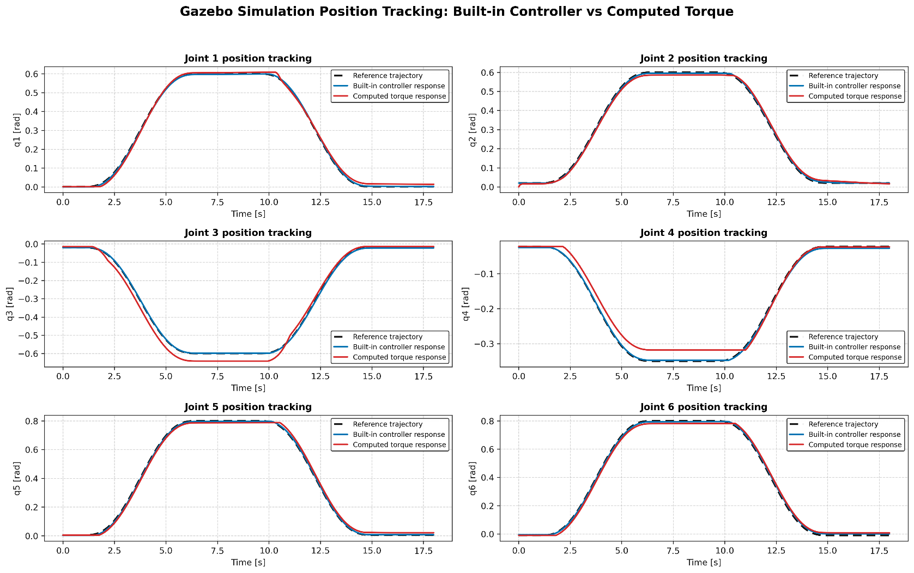
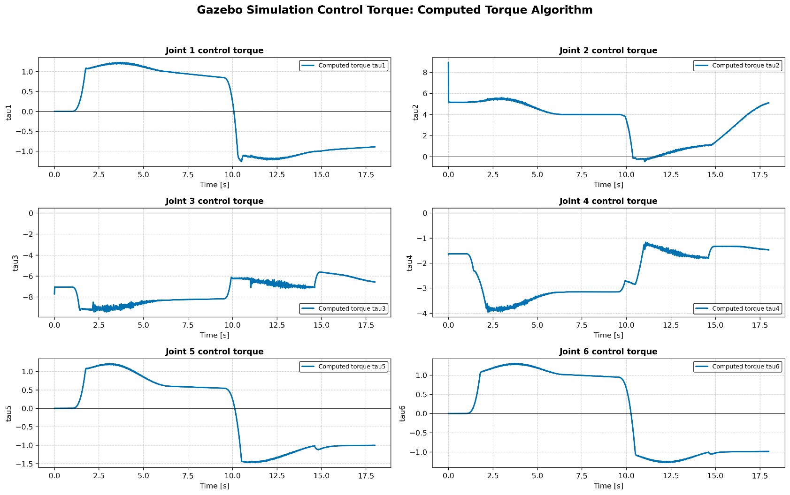
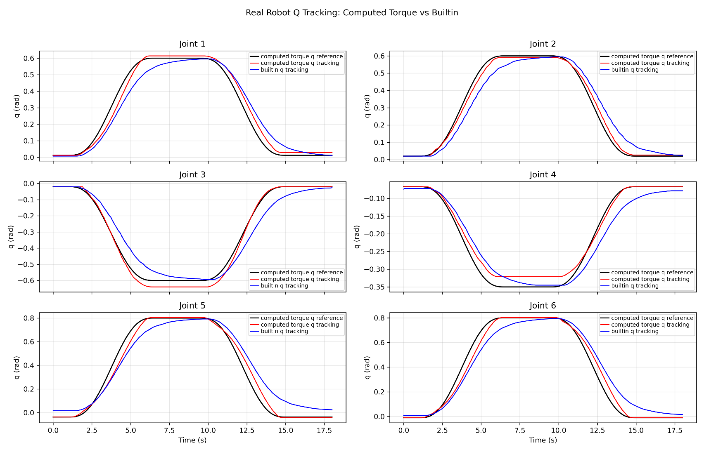
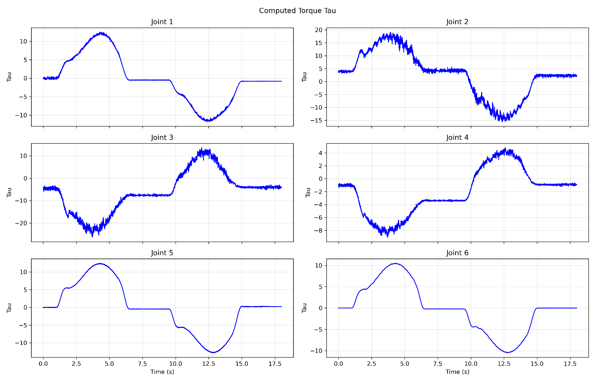

# MCN computed-torque control for Unitree Z1

This project implements a six-joint computed-torque controller for the Unitree Z1. It evaluates the MCN dynamics model in Python and in a C++ extension exposed through pybind11. The Python/C++ experiment compares the complete Gazebo control-loop rate. The controller uses

    tau = M(q) [ddq_ref + Kd (dq_ref - dq) + Kp (q_ref - q)] + C(q, dq) dq + N(q, dq)

The Gazebo version publishes torque commands to six effort controllers. The real-robot LowCmd script sends MCN computed torque through the Unitree arm interface. A separate HighCmd script provides a built-in controller baseline; it does not calculate MCN torque.

## Highlights

- Custom six-DOF MCN dynamics model using a product-of-exponentials (POE) / Lie-group formulation.
- Pinocchio validation across 50 randomized joint states.
- Computed-torque control for all six Unitree Z1 joints.
- Measured full Gazebo control-loop rate: 40.3 Hz with Python versus 196.7 Hz (approximately 200 Hz) with the C++/pybind11 backend.
- Torque-level control in Gazebo and on a physical Unitree Z1.

## My Contributions

I implemented the six-DOF dynamics model, the computed-torque controller, the Pinocchio validation, and the C++/pybind11 dynamics backend. I also integrated torque commands with Gazebo effort controllers and implemented the physical Z1 LowCmd torque-only controller. The Unitree SDK/URDF, ROS/Gazebo, and Pinocchio are external tools and dependencies.

## Results and demo

These exported poster figures show position tracking and computed-torque commands in Gazebo and on the real Z1. The position plots compare the computed-torque controller with the built-in controller. They are separate from the Python/C++ loop-timing experiment described below; the figures do not establish the 40.3 Hz and 196.7 Hz results.

Gazebo simulation — position tracking:

Gazebo simulation — computed-torque commands:

Real robot — position tracking:

Real robot — computed-torque commands:

## Repository contents

| Path | Purpose |
| --- | --- |
| scripts/MCN_CT.py | Z1 model parameters, Python MCN implementation, trajectory and Gazebo control loop; automatically selects C++ when available (or accepts --backend) |
| scripts/MCN_CT_backend_compare.py | Same MCN computed-torque control loop with a required Python or C++ backend choice, backend-specific CSV name and loop-timing report |
| scripts/mcn_dynamics.cpp | C++ MCN dynamics implementation returning M, C and N |
| scripts/setup_mcn_cpp.py | Builds the Python-loadable C++ extension |
| scripts/switch_to_effort.sh, config/z1_effort_controllers.yaml | Switches Gazebo to six effort controllers |
| scripts/compare_mcn_pinocchio.py | Compares both MCN implementations with the Z1 Pinocchio model |
| scripts/MCN_CT_lowcmd_real.py | Real-arm MCN torque control through LowCmd |
| scripts/MCN_CT_highcmd_real.py | Real-arm HighCmd reference-tracking baseline |
| data/simulation/, data/real/ | Selected recorded joint tracking and torque data |
| results/figures/ | Four exported poster figures from the simulation and real-robot experiments |

The original Unitree SDK, URDF and compiled libraries are external dependencies and are not copied into this repository.

## Environment

- Ubuntu 20.04, ROS Noetic, Gazebo, Python 3 and a built [Unitree z1_ros workspace](https://github.com/unitreerobotics/z1_ros).
- Python modules: numpy, matplotlib, pybind11 and setuptools. The ROS Python modules come from the sourced Noetic environment.
- The Pinocchio comparison additionally requires pinocchio and the z1_controller package, including config/z1.urdf.
- The real-arm scripts additionally require a working z1_controller and the z1_sdk Python interface (unitree_arm_interface) built in the Unitree workspace.

The examples below assume the Unitree workspace is at ~/z1_ws and this repository is at ~/MCN_ComputedTorque. Change those paths for your machine. No Z1 SDK files need to be copied into this repository.

## Build the C++ backend

~~~bash
source /opt/ros/noetic/setup.bash
source ~/z1_ws/devel/setup.bash
cd ~/MCN_ComputedTorque/scripts
python3 setup_mcn_cpp.py build_ext --inplace
~~~

This creates mcn_dynamics*.so beside MCN_CT.py. Rebuild after changing mcn_dynamics.cpp or the Python version. The generated .so is intentionally excluded from Git.

## Run in Gazebo

In one terminal, start the Z1 simulation and z1_ctrl through z1_bringup:

~~~bash
source /opt/ros/noetic/setup.bash
source ~/z1_ws/devel/setup.bash
roslaunch z1_bringup sim_ctrl.launch
~~~

sim_ctrl.launch includes unitree_gazebo/z1.launch and starts z1_ctrl. The included Gazebo launch initially loads six UnitreeJointControllers, not the effort controllers used by this MCN script. After Gazebo has loaded the robot, run the following in a second terminal to stop those six joint controllers and load/start the six effort controllers defined in this repository:

~~~bash
bash ~/MCN_ComputedTorque/scripts/switch_to_effort.sh
~~~

The script uses ~/z1_ws/devel/setup.bash by default. For a different workspace, set ROS_WS_SETUP to its devel/setup.bash path.

In a third terminal, run the controller:

~~~bash
source /opt/ros/noetic/setup.bash
source ~/z1_ws/devel/setup.bash
cd ~/MCN_ComputedTorque/scripts
python3 MCN_CT_backend_compare.py --backend cpp
~~~

Run the same command again with --backend python for the Python loop. The script requires an explicit backend choice, prints the selected backend, and reports both mean full-loop time and MCN calculation time. Its full-loop timing includes the control work and rate.sleep(). It subscribes to /z1_gazebo/joint_states and publishes six /z1_gazebo/jointN_effort_controller/command topics. Generated tracking CSVs stay under scripts/ and are ignored by Git.

## Compare implementations

From the sourced ROS environment and the scripts/ directory, run the two backends with the same time step and motion settings. The third command is a separate offline dynamics check:

~~~bash
python3 MCN_CT_backend_compare.py --backend python --dt 0.005 --T 18
python3 MCN_CT_backend_compare.py --backend cpp --dt 0.005 --T 18
python3 compare_mcn_pinocchio.py --samples 50
~~~

The first two commands are separate Gazebo runs with a requested 200 Hz period (0.005 s). The terminal results recorded for the two backend runs were:

| Backend | Mean full-loop time | Actual full-loop rate | Mean MCN calculation time |
| --- | ---: | ---: | ---: |
| Python | 24.799 ms | 40.3 Hz | 23.374 ms |
| C++ | 5.083 ms | 196.7 Hz | 0.078 ms |

These are full control-loop measurements, not a standalone dynamics benchmark. The script uses time.perf_counter() around each complete iteration, including rate.sleep(), and times the MCN calculation separately. The requested 200 Hz is a target; the C++ run averaged 196.7 Hz. CSV timestamps use ROS/Gazebo time; the console's actual loop dt avg is the relevant wall-clock performance measure.

The older MCN_CT.py used automatic backend selection and wrote MCN_CT_tracking_tau.csv by default. MCN_CT_backend_compare.py uses the same controller and dynamics calculations but requires an explicit --backend python or --backend cpp, so the two implementations can be timed separately. Both versions measure full-loop and MCN calculation time; the comparison version did not introduce the timing instrumentation. The current MCN_CT.py also accepts --backend and writes a backend-specific CSV name by default.

The third command, compare_mcn_pinocchio.py --samples 50, draws 50 random joint positions, velocities and accelerations within the configured ranges. It compares my hand-derived six-DOF POE/Lie-group MCN dynamics (Python and C++) with Pinocchio using the external z1_controller/config/z1.urdf. The results below are the maximum absolute elementwise differences across the 50 tested states:

| Dynamics term | Python max. absolute error | C++ max. absolute error |
| --- | ---: | ---: |
| Inertia matrix M | 4.440892e-16 | 3.330669e-16 |
| Gravity G | 7.105427e-15 | 7.105427e-15 |
| Velocity term C @ dq | 2.823425e-08 | 3.168472e-15 |
| Nonlinear term h | 2.823425e-08 | 5.329071e-15 |
| Predicted torque tau | 2.823425e-08 | 5.329071e-15 |

These very small numerical errors show close agreement with Pinocchio and support the accuracy of the manually derived model for the tested states. The script also reports mean and median errors. This check does not start Gazebo, publish commands or measure control-loop speed. It requires the pinocchio Python module and access to the z1_controller ROS package. Without the C++ extension, it checks only the Python implementation.

The included data/simulation/MCN_CT_tracking_tau.csv contains recorded time, reference positions, measured positions and commanded torques. The data/real/ files contain the recorded HighCmd baseline and LowCmd computed-torque runs. Recorded CSVs are examples, not inputs required by the controller.

## Real-arm experiments

MCN_CT_lowcmd_real.py uses the external z1_sdk/lib/unitree_arm_interface extension and sends computed torque through LowCmd. MCN_CT_highcmd_real.py uses the same interface for a HighCmd baseline. Both require the Unitree real-arm controller to be running and the arm to be ready. Consult each script's command-line help and verify its parameters on the target arm before operation.
